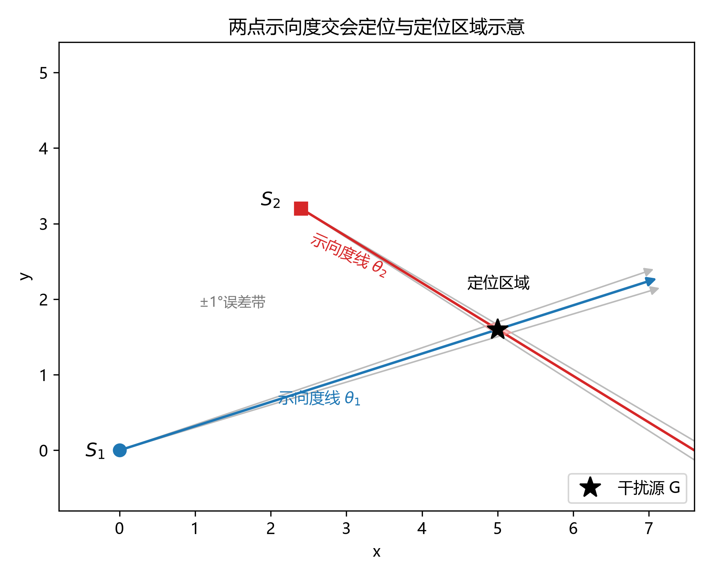
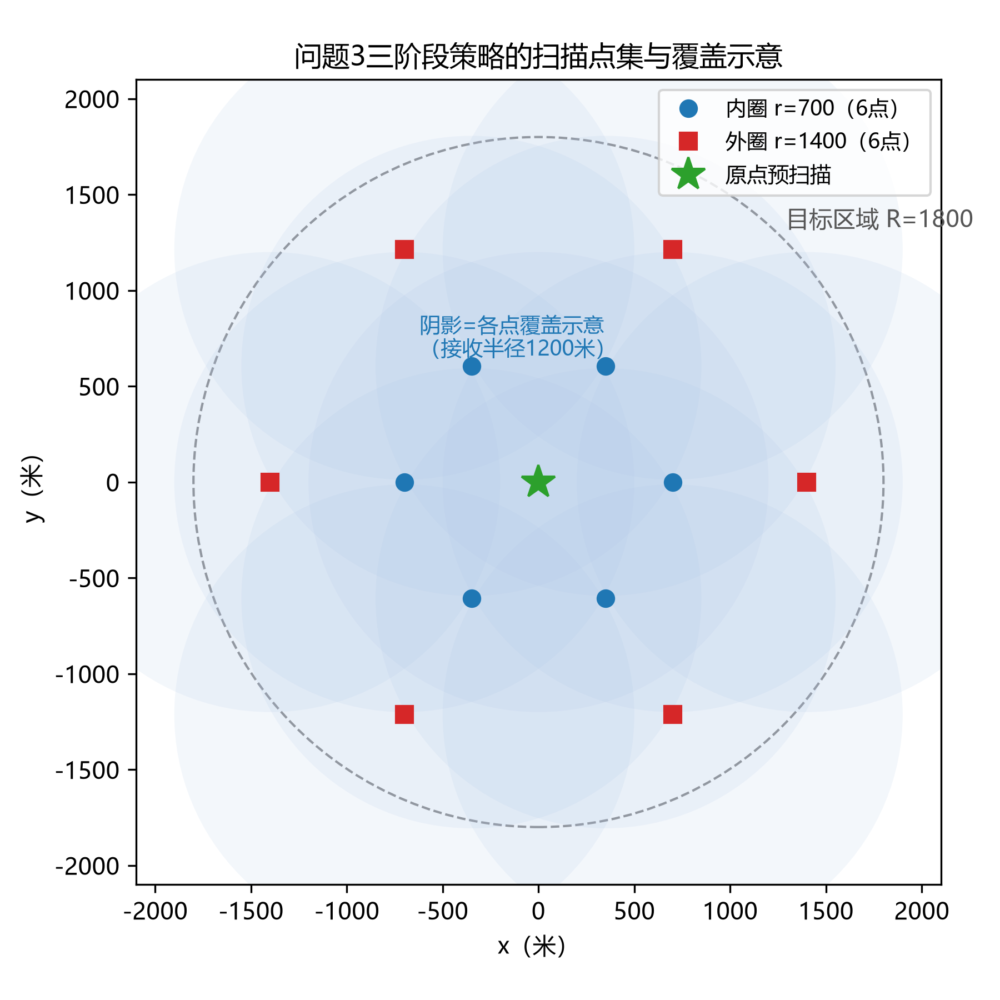
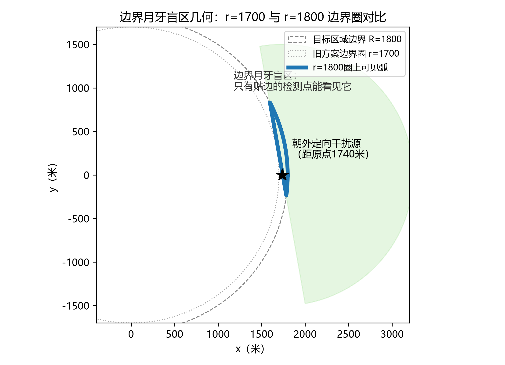
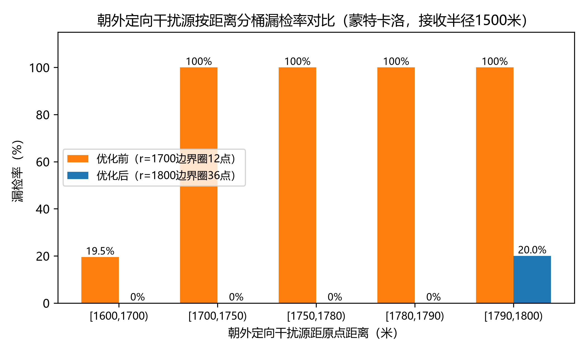

# 无线电干扰源的快速自动定位与清除

## 摘要

本文围绕无线电干扰源的自动定位与清除问题建模，核心思路是测向交会定位加分级搜索，并据此设计了机器狗自动搜索、定位、清除干扰源的整套算法。

问题1要求计算多边形定位区域的直径。本文把示向度带形区域的交集建模为凸多边形，先用半平面裁剪求交集，再用旋转卡壳法求直径，复杂度为 $O(n^2)$。此外还讨论了覆盖性：以直径为直径的圆一般盖不住整个定位区域，需要时应改用最小包围圆。

问题2研究第二检测点怎么选。通过分析两带形交集面积与交会角的关系，本文的结论是：第二检测点应放在垂直于示向度方向、距离约800米处；候选区域是以第一检测点为中心、半径500至1000米圆环内、垂直方向 $\pm 30^\circ$ 的扇形。

问题3的干扰源全部为全向，本文采用**三阶段分级搜索策略**：先在原点预扫描全部20个频道，有信号的频道直接做两点交会定位加9点网格清除，没信号的频道再走半径700米与1400米的两圈环形搜索。针对靠近区域边缘、垂直偏移会超出有效接收半径的干扰源，另外加了两个兜底机制：第二点距离回退（800→400→200米）和双检测点直接交会。多轮演练测试清除比例均为100%；正式测试2、3分别清除15个和14个干扰源，平均定位清除时间约964秒与1269秒。蒙特卡洛检验（5万次采样）表明，扫描点集对全向干扰源的理论漏检率为0。

问题4在问题3基础上加入定向干扰源，策略扩展为**四阶段**：四方向第二检测点交会；三圈密集环形搜索（半径500/1000/1500米，共34点）；按频道检测状态拆分的专项搜索，已见频道走中圈，未见频道走半径1800米边界圈做36点加密扫描，辅以5°错位二轮加密与沿示向度射线步进清除兜底。对覆盖角朝外或切向的边缘干扰源，本文建立了"边界月牙"盲区模型来解释其漏检机理。演练测试清除比例均为100%（含纯定向干扰源的极端案例）；正式测试2、3分别清除15个和13个干扰源，平均定位清除时间约1794秒与2024秒。蒙特卡洛检验显示，随机朝向的定向干扰源漏检率为0，最坏朝外朝向也只有约0.23%。

**关键词**：无线电干扰源；测向交会定位；分级搜索策略；定向干扰源；网格清除；机器狗；鲁棒性分析

## 一、问题重述

### 1.1 问题背景

无线电干扰源的定位与清除是无线电频谱管理的重要任务[1]。在精准定位阶段，技术人员需携带便携式测向机徒步排查，效率低且存在安全风险。某公司拟研发搭载于机器狗的干扰源自动定位清除系统，在危险环境中代替技术人员开展工作。

### 1.2 问题1：多边形定位区域直径的计算算法

已知若干个检测点坐标 $S_i = (x_i, y_i)$（$i=1,2,\ldots,n$）及某干扰源 $G$ 关于这些检测点的示向度 $\theta_i$。采用交会定位法，利用带有 $\pm 1^\circ$ 误差的示向度射线相交形成多边形定位区域。要求：

1. 给出计算该多边形定位区域直径的算法。
2. 判断以定位区域直径为直径的圆能否覆盖此定位区域。

### 1.3 问题2：第二检测点的选择策略

已知某全向干扰源 $G$ 在一个检测点 $S_1 = (x_1, y_1)$ 处测得的示向度为 $\theta_1$。请给出第二个检测点 $S_2$ 的选择策略，以获得关于该干扰源较好的定位效果，并给出 $S_2$ 的候选区域。

### 1.4 问题3：全向干扰源的搜索定位与清除

目标区域为半径1800米的圆形区域，以圆心为坐标原点，正东为 $x$ 轴正向，正北为 $y$ 轴正向。区域中的干扰源均为全向干扰源，总数在10至16个之间，每个干扰源占据不同频道（编号1至20）。机器狗从原点出发，测向机初始频道为1，对目标区域中的干扰源进行自动定位并清除。在确保所有干扰源被清除的前提下，完成任务的时间越短越好。

### 1.5 问题4：含定向干扰源的搜索定位与清除

在问题3基础上增加定向干扰源。定向干扰源信号仅在以定向方向为中心的180°覆盖角内辐射，覆盖角外无法接收信号，有效接收半径同样为1000至1500米。机器狗需对全向与定向干扰源进行自动定位并清除。

**评估指标**（问题3、问题4）：

- 被清除干扰源个数比例 $= \dfrac{\text{被清除干扰源的个数}}{\text{干扰源总数}}$
- 平均定位清除时间 $= \dfrac{\text{定位清除总时间}}{\text{被清除干扰源的个数}}$

其中定位清除总时间包含机器狗移动时间、频道切换时间、检测时间、光学精确定位时间及清除时间。

## 二、模型假设与符号说明

### 2.1 模型假设

1. 目标区域内的干扰源分为全向和定向两类：全向干扰源信号在360°范围内均匀辐射；定向干扰源仅在以定向方向为中心的180°覆盖角内辐射。每个干扰源占据一个频道且频道互不相同、信号互不影响。
2. 每个干扰源的有效接收半径在1000米至1500米之间，距离超过该半径时接收不到信号。
3. 测向机测得的示向度与干扰源真实方位角之间存在误差，全局误差范围为 $[-1^\circ, 1^\circ]$。
4. 机器狗沿直线行进，移动速度为5米/秒；每次检测耗时5秒，任意两个频道之间的切换耗时1秒。
5. 光学探测仪在距离干扰源不超过20米时可精确定位并清除，精确定位耗时3秒、清除耗时2秒；当检测点与干扰源距离不超过5米且在覆盖角内时信号过强、无法获得示向度，可直接清除。
6. 忽略机器狗与干扰源的高度差异，认为二者位于同一平面；定向干扰源的类型与定向方向在搜索前未知，需通过检测结果推断。

### 2.2 符号说明

| 符号 | 含义 |
|------|------|
| $R$ | 目标区域半径，$R=1800$米 |
| $r_{\text{eff}}$ | 干扰源有效接收半径，$r_{\text{eff}} \in [1000, 1500]$米 |
| $v$ | 机器狗移动速度，$v=5$米/秒 |
| $t_m$ | 单次检测耗时，$t_m=5$秒 |
| $t_c$ | 频道切换耗时，$t_c=1$秒 |
| $t_p$ | 光学精确定位耗时，$t_p=3$秒 |
| $t_k$ | 激光枪清除耗时，$t_k=2$秒 |
| $r_{\text{clear}}$ | 清除半径，$r_{\text{clear}}=20$米 |
| $r_{\text{near}}$ | 近距离阈值，$r_{\text{near}}=5$米 |
| $\Delta\theta$ | 示向度测量误差范围，$\Delta\theta \in [-1^\circ, 1^\circ]$ |
| $\theta_i$ | 检测点 $S_i$ 处测得的示向度（度） |
| $S_i = (x_i, y_i)$ | 第 $i$ 个检测点的坐标 |
| $G = (x_g, y_g)$ | 干扰源的真实坐标 |
| $\hat{G} = (\hat{x}_g, \hat{y}_g)$ | 交会定位得到的干扰源估计坐标 |
| $\phi$ | 定向干扰源的定向方向（度） |
| $\alpha$ | 定向干扰源覆盖角半宽，$\alpha = 90^\circ$ |

## 三、问题1：多边形定位区域直径的计算算法

### 3.1 示向度带形区域的数学描述

由于示向度 $\theta_i$ 存在 $\pm 1^\circ$ 的误差，每个检测点 $S_i$ 给出的不是一条射线，而是一个角度范围为 $[\theta_i - 1^\circ, \theta_i + 1^\circ]$ 的扇形区域。该扇形区域可以表示为两条边界射线所夹的带形区域。

设 $S_i$ 处的示向度为 $\theta_i$，则两条边界射线的方向角分别为：

$$\theta_i^- = \theta_i - 1^\circ, \quad \theta_i^+ = \theta_i + 1^\circ \tag{1}$$

对应的两条边界射线方程为：

$$L_i^-: \begin{cases} x = x_i + t\cos\theta_i^- \\ y = y_i + t\sin\theta_i^- \end{cases}, \quad t \geq 0 \tag{2}$$

$$L_i^+: \begin{cases} x = x_i + t\cos\theta_i^+ \\ y = y_i + t\sin\theta_i^+ \end{cases}, \quad t \geq 0 \tag{3}$$

检测点 $S_i$ 对应的带形区域 $B_i$ 为 $L_i^-$ 和 $L_i^+$ 所夹的扇形区域。

### 3.2 定位区域的形成

多个检测点的带形区域的交集即为干扰源 $G$ 的定位区域（文献[2]称之为交叉定位模糊区）：

$$P = \bigcap_{i=1}^{n} B_i \tag{4}$$

由于每个 $B_i$ 是凸集（扇形区域），它们的交集 $P$ 也是凸集。$P$ 是一个凸多边形。

### 3.3 多边形定位区域直径的计算算法

**定义**：多边形 $P$ 的直径 $D(P)$ 定义为区域内任意两点之间距离的最大值：

$$D(P) = \max_{A, B \in P} \|A - B\| \tag{5}$$

算法分三步。

**步骤1：求带形区域的交集**

依次计算 $B_1 \cap B_2 \cap \ldots \cap B_n$。对于每个检测点，求当前多边形与新带形区域 $B_i$ 的交集。带形区域可以表示为两条半平面的交集，因此求交集等价于对多边形进行半平面裁剪。

具体地，带形区域 $B_i$ 可以表示为两个半平面的交集：

$$B_i = H_i^- \cap H_i^+ \tag{6}$$

其中 $H_i^-$ 是射线 $L_i^-$ 逆时针方向的半平面，$H_i^+$ 是射线 $L_i^+$ 顺时针方向的半平面。

**步骤2：提取多边形顶点**

交集运算完成后，得到定位区域 $P$ 的顶点集合 $V = \{V_1, V_2, \ldots, V_m\}$，按逆时针或顺时针顺序排列。

**步骤3：计算顶点间距离的最大值（旋转卡壳法）**

由于 $P$ 是凸多边形，直径必定出现在两个顶点之间。可以用旋转卡壳法（Rotating Calipers）在 $O(m)$ 时间内算出凸多边形的直径：

1. 初始化：取对踵点对 $(V_i, V_j)$，其中 $V_j$ 是距离 $V_i$ 最远的顶点。
2. 依次遍历每条边，计算该边的法线方向，找到对应的对踵点。
3. 遍历过程中不断更新最大距离。

复杂度方面，求交集为 $O(nm)$，旋转卡壳为 $O(m)$，其中 $n$ 为检测点个数，$m$ 为定位区域顶点数。由于每条边最多贡献2个顶点，$m \leq 2n$，总体复杂度为 $O(n^2)$。

### 3.4 以直径为直径的圆的覆盖性分析

现在判断：以定位区域直径 $D(P)$ 为直径的圆 $C_D$ 能否覆盖整个定位区域 $P$？

结论是，一般情况下不能保证覆盖。分析如下。

设直径的两个端点为 $A$ 和 $B$，则圆 $C_D$ 的圆心为 $M = \frac{A+B}{2}$，半径为 $\frac{D(P)}{2}$。

对于区域内任意一点 $X \in P$，要使 $X$ 被圆 $C_D$ 覆盖，需满足：

$$\|X - M\| \leq \frac{D(P)}{2} \tag{7}$$

即：

$$\|X - \frac{A+B}{2}\| \leq \frac{\|A-B\|}{2} \tag{8}$$

两边平方并整理得：

$$(X - A) \cdot (X - B) \leq 0 \tag{9}$$

即 $\angle AXB \geq 90^\circ$。

因此，圆 $C_D$ 覆盖 $P$ 的充要条件是：对任意 $X \in P$，都有 $\angle AXB \geq 90^\circ$。

举个反例：设定位区域为正三角形 $ABC$，其直径 $D = |AB| = |BC| = |CA|$。以 $AB$ 为直径的圆盖不住顶点 $C$，因为 $\angle ACB = 60^\circ < 90^\circ$。

特殊情况是，当定位区域为线段（退化情形），或满足所有点对直径端点的张角均 $\geq 90^\circ$ 时，以直径为直径的圆才可以覆盖该区域。

### 3.5 更优的覆盖方案

若确实要用圆覆盖定位区域，应改用最小包围圆（Minimum Enclosing Circle, MEC）。最小包围圆的直径 $D_{\text{MEC}} \geq D(P)$，且 $D_{\text{MEC}} \leq \frac{2}{\sqrt{3}} D(P) \approx 1.1547 D(P)$（Jung 定理）。

最小包围圆的算法（Welzl 算法）可在 $O(m)$ 期望时间内求得。

## 四、问题2：第二检测点的选择策略与候选区域

<!-- ══ 问题2优化·修改①：4.1/4.2 定位效果度量由"面积"改为"位置误差"，式(11)重写为误差公式（式号不变） ══ -->
### 4.1 定位效果的衡量

交会定位的定位区域大小由两个带形区域（$B_1$ 和 $B_2$）的交集决定。衡量定位效果可以用定位区域的面积或直径，但更贴合问题目标的是位置估计误差：本问题最终要把机器狗带到干扰源20米范围内，直接看"交会定位得到的估计点 $\hat{G}$ 离真实位置 $G$ 有多远"更合适。因此本文以位置估计误差（均方根，RMS）作为第二检测点选择的优化目标。

### 4.2 位置误差与交会角、距离的关系

设 $S_1$ 处的示向度为 $\theta_1$，$S_2$ 处的示向度为 $\theta_2$，两条示向度射线的夹角为：

$$\gamma = |\theta_2 - \theta_1 \pm 180^\circ| \tag{10}$$

（取较小的夹角，$0 \leq \gamma \leq 90^\circ$）

对纯方位（bearing-only）定位，位置估计误差可由 Fisher 信息矩阵（等价地由几何精度因子 GDOP）给出，其均方根误差为：

$$\sigma_p = \frac{\sigma_\theta}{\sin\gamma}\sqrt{d_1^2 + d_2^2} \tag{11}$$

其中 $d_1, d_2$ 分别为 $S_1, S_2$ 到干扰源 $G$ 的距离；$\sigma_\theta$ 为示向度误差的均方根，题目给出误差范围为 $[-1^\circ, 1^\circ]$，若近似为均匀分布，则 $\sigma_\theta = 1^\circ/\sqrt{3} \approx 0.58^\circ$；若要给出保守上界，可令 $\sigma_\theta$ 取误差上界 $1^\circ$。

由式(11)，当 $\gamma \to 0$（两示向度线平行）时 $\sin\gamma \to 0$，误差发散；当 $\gamma = 90^\circ$ 时误差最小。所以第二检测点要尽量让交会角 $\gamma$ 接近 $90^\circ$。这也与传感器—目标最优定位几何的结论一致：对纯方位（bearing-only）定位，正交布置的传感器几何能最小化定位误差[6]。
<!-- ══ 修改①结束 ══ -->

<!-- ══ 问题2优化·修改②：4.3 距离由"拍脑袋取800"改为"误差最小化+接收半径约束"的解析折中 ══ -->
### 4.3 第二检测点选择策略

由于干扰源 $G$ 的具体位置未知，只知道 $G$ 在 $S_1$ 的 $\theta_1$ 方向上（且在有效接收半径内）。由式(11)，为使 $\gamma$ 接近 $90^\circ$，$S_2$ 应选择在垂直于 $\theta_1$ 的方向上，即 $S_2$ 取在 $S_1$ 的 $\theta_1 \pm 90^\circ$ 方向上。方向确定后，还需规定第一、第二检测点的间距（基线长度）$s = |S_1 S_2|$。

把 $S_2$ 放到垂直方向后，$S_2$ 到干扰源的距离 $d_2 = \sqrt{d_1^2 + s^2}$，交会角满足 $\sin\gamma = s/d_2$，代入式(11)得基线长度 $s$ 与误差的关系：

$$\sigma_p = \sigma_\theta\,\frac{\sqrt{(2d_1^2 + s^2)(d_1^2 + s^2)}}{s}$$

在干扰源距离 $d_1$ 已知时，上式在 $s = 2^{1/4}d_1 \approx 1.19\,d_1$ 处取最小，即基线取目标距离的约1.2倍时误差最小；$s$ 过小（两检测点贴得太近）或过大（$d_2$ 变远）都会使误差增大。

但 $d_1$ 实际未知，还需在"误差随 $d_1$ 增大"与"接收半径约束"之间折中：$S_2$ 必须仍能收到信号，即 $d_2 = \sqrt{d_1^2 + s^2} \le r_{\text{eff}}$。取最坏情形接收半径 $r_{\text{eff}} = 1000$ 米、基线 $s = 800$ 米时，能覆盖到 $d_1 = \sqrt{1000^2 - 800^2} = 600$ 米以内的近处干扰源，且对这些干扰源交会角 $\gamma = \arcsin(s/d_2)$ 落在 $45^\circ \sim 53^\circ$，误差保持在较低水平；$s$ 再大则最坏接收半径下的覆盖范围更小，$s$ 再小则 $\gamma$ 退化。因此取 $s = d = 800$ 米；更远（$d_1$ 更大、垂直偏移够不着）的干扰源交给后文问题3的"距离回退（800→400→200米）"与"双检测点直接交会"兜底。
<!-- ══ 修改②结束 ══ -->

### 4.4 第二检测点的候选区域

<!-- ══ 问题2优化·修改③：4.4 给候选区域的方向±30°、半径[500,1000]补上解析依据 ══ -->
把方向放宽到垂直方向 $\pm 30^\circ$（此时 $\sin\gamma \ge \sin 60^\circ \approx 0.866$，误差仅比正交时多约15%），基线长度放宽到 $500 \sim 1000$ 米（下限保证 $\gamma$ 不至过小，上限保证最坏接收半径下 $S_2$ 仍能收到信号），就得到 $S_2$ 的候选区域：
<!-- ══ 修改③结束 ══ -->

$$\boxed{S_2 \in \{ S_1 + d \cdot (\cos\alpha, \sin\alpha) : d \in [500, 1000], \alpha \in [\theta_1 + 60^\circ, \theta_1 + 120^\circ] \cup [\theta_1 + 240^\circ, \theta_1 + 300^\circ] \}} \tag{12}$$

总结一下策略：

1. 方向：$S_2$ 优先选在 $S_1$ 的 $\theta_1 \pm 90^\circ$ 方向。
2. 距离：$S_1$ 与 $S_2$ 相距800米左右。
3. 候选区域：以 $S_1$ 为中心、半径500至1000米的圆环内、垂直于 $\theta_1$ 方向 $\pm 30^\circ$ 的扇形。
4. 若 $S_2$ 处测不到信号，就挪动位置重新检测。

## 五、问题3：全向干扰源的搜索定位与清除策略

### 5.1 问题分析

问题3的核心是在不知道干扰源数量和位置的情况下，设计机器狗的搜索、定位与清除策略，属于典型的多目标主动搜索问题[3]。它可以拆成两个子问题：

子问题1是全局搜索：怎么在半径1800米的圆形区域内把所有干扰源都找出来？由于有效接收半径只有1000至1500米，原点不一定能看到全部干扰源，搜索路径需要规划。

子问题2是精准定位与清除：发现某个频道的信号后，怎么用示向度交会法定出干扰源位置，并在20米清除半径内清掉它？示向度有±1°误差，得留出误差余量。

### 5.2 交会定位数学模型

#### 5.2.1 两点示向度交会原理

设干扰源 $G$ 在两个检测点 $S_1=(x_1,y_1)$ 和 $S_2=(x_2,y_2)$ 处的示向度分别为 $\theta_1$ 和 $\theta_2$。示向度定义为从 $x$ 轴正向逆时针旋转至检测点指向干扰源向量的角度。两检测点交会定位的几何关系如图1所示。



图1 两点示向度交会定位与定位区域示意

从 $S_1$ 出发，沿示向度 $\theta_1$ 方向的射线参数方程为：

$$\begin{cases} x = x_1 + t\cos\theta_1 \\ y = y_1 + t\sin\theta_1 \end{cases}, \quad t \geq 0 \tag{13}$$

从 $S_2$ 出发，沿示向度 $\theta_2$ 方向的射线参数方程为：

$$\begin{cases} x = x_2 + s\cos\theta_2 \\ y = y_2 + s\sin\theta_2 \end{cases}, \quad s \geq 0 \tag{14}$$

联立式(13)与式(14)求两射线的交点 $\hat{G}=(\hat{x}_g, \hat{y}_g)$，令 $\Delta x = x_2 - x_1$，$\Delta y = y_2 - y_1$，解得：

$$t = \frac{\Delta x \cdot \sin\theta_2 - \Delta y \cdot \cos\theta_2}{\cos\theta_1 \cdot \sin\theta_2 - \sin\theta_1 \cdot \cos\theta_2} \tag{15}$$

当分母 $D = \cos\theta_1\sin\theta_2 - \sin\theta_1\cos\theta_2 = \sin(\theta_2 - \theta_1) \neq 0$ 时，交点存在：

$$\hat{x}_g = x_1 + t\cos\theta_1, \quad \hat{y}_g = y_1 + t\sin\theta_1 \tag{16}$$

当 $\theta_1 \approx \theta_2$ 时，$D \approx 0$，两射线近乎平行，交会点极不稳定。

#### 5.2.2 第二检测点选择策略

为保证交会定位的稳定性，两条示向度射线的夹角应尽可能大。若第二检测点 $S_2$ 沿示向度方向前进，则 $S_2$ 处示向度 $\theta_2 \approx \theta_1$，两线近乎平行，定位失效。

本文的做法是让第二检测点落在垂直于示向度 $\theta_1$ 的方向上，移动距离 $d=800$ 米，即：

$$S_2 = S_1 + d \cdot (\cos(\theta_1 \pm 90^\circ), \sin(\theta_1 \pm 90^\circ)) \tag{17}$$

实际中尝试 $\pm 90^\circ$ 两个方向，选择能检测到信号的方向作为第二检测点。选择 $d=800$ 米的依据：有效接收半径最小为1000米，800米的垂直偏移仍在大部分干扰源的接收范围内，同时能保证足够的交会角。

对于靠近目标区域边缘的干扰源（距检测点超过约1200米），800米垂直偏移可能使第二检测点超出有效接收半径而检测不到信号。为此设置**距离回退机制**：当800米偏移检测不到信号时，依次减小偏移距离至400米、200米重试，让第二检测点保持在有效接收半径内，再配合9点网格清除，成功率还是有保障的。

#### 5.2.3 示向度误差与定位偏差分析

<!-- ══ 问题2优化·修改④：5.2.3 式(18)(19) 把有误的"检测点间距d"改为标准的"检测点到目标距离d1,d2"，数值仍≈28米 ══ -->
由于示向度存在 $\pm 1^\circ$ 误差，真实干扰源 $G$ 可能偏离交会点 $\hat{G}$。考虑观测位置自身不确定性的纯方位定位误差分析可参考文献[5]。沿用4.2节的误差模型，两检测点交会的定位偏差（均方根）为：

$$\sigma_p = \frac{\sigma_\theta}{\sin\gamma}\sqrt{d_1^2 + d_2^2} \tag{18}$$

其中 $d_1, d_2$ 为两个检测点到干扰源的距离。取典型的 $d_1 = d_2 = 800$ 米、交会角 $\gamma = 45^\circ$，并让 $\sigma_\theta$ 保守地取误差上界 $\delta = 1^\circ \approx 0.0175$ 弧度：

$$\sigma_p \approx \frac{0.0175}{\sin 45^\circ}\sqrt{800^2 + 800^2} \approx 28 \text{米} \tag{19}$$

这个量级的偏差很可能超过20米清除半径，因此需要设计网格清除策略覆盖偏差。
<!-- ══ 修改④结束 ══ -->

### 5.3 网格清除模型

在交会估计点 $\hat{G}$ 周围设置网格清除点，确保即使存在定位偏差，清除点仍落在干扰源20米范围内。

**9点网格设计**：以估计点 $\hat{G}$ 为中心，在半径 $r_g=25$ 米的8个方向（每隔 $45^\circ$）各设置一个清除点，加上中心点共9个点：

$$\text{清除点} = \{(\hat{x}_g, \hat{y}_g)\} \cup \{(\hat{x}_g + 25\cos\alpha, \hat{y}_g + 25\sin\alpha) : \alpha = 0^\circ, 45^\circ, \ldots, 315^\circ\} \tag{20}$$

选择 $r_g=25$ 米的依据：当定位偏差不超过 $25$ 米时，9点网格中至少有一个点与干扰源的距离不超过约19.1米 $< 20$ 米，可成功清除。与25点密集网格（5×5）相比，9点网格将失败清除尝试从最多25次降至最多9次，显著节省时间。

### 5.4 三阶段分级搜索策略

**阶段1：原点全频道预扫描**

机器狗在原点 $(0,0)$ 对全部20个频道逐一检测（每次检测耗时5秒，频道切换耗时1秒），将频道分为两类：
- **有信号频道**：检测到 `direction` 或 `near`，说明干扰源在原点1500米接收半径内
- **无信号频道**：检测到 `no_signal`，说明干扰源可能在1500米至1800米的边缘区域

该阶段耗时约 $20 \times 5 + 19 \times 1 = 119$ 秒。

**阶段2：有信号频道直接定位清除**

对每个有信号频道，利用原点的示向度，按5.2.2节的策略选择垂直方向第二检测点，执行两点交会定位，再按5.3节的9点网格清除。

**阶段3：无信号频道环形搜索**

对阶段1中检测为 `no_signal` 或阶段2定位失败的频道，执行两阶段环形搜索：
- **内圈搜索**：在半径 $r=700$ 米的圆周上等距取6个点，对每个待搜频道检测。
- **外圈搜索**：若内圈搜索后仍有未清除频道，在半径 $r=1400$ 米的圆周上等距取6个点重复检测。

每个搜索点检测到信号后，除垂直偏移第二点交会外，还引入**双检测点直接交会**机制：同一频道在环形搜索中可能被多个搜索点检测到，此时直接利用两个已测搜索点的示向度进行交会定位（要求两搜索点间距不小于300米、交会角满足 $|\sin(\theta_2-\theta_1)| \geq 0.2$，并优先选择交会角最大的检测点对以保证几何质量最好），无需额外移动即可完成定位，特别适用于靠近区域边缘、垂直偏移会超出有效接收半径的干扰源。

选择 $r=700$ 和 $r=1400$ 的依据：

- $r=700$：覆盖原点检测盲区（1500米半径边缘）
- $r=1400$：确保覆盖1800米目标区域的全部范围

扫描点集的整体布置如图2所示，各检测点的覆盖圆（示意半径取1200米）叠加后可以覆盖整个目标区域。



图2 问题3三阶段策略的扫描点集与覆盖示意

环形搜索把圆周等距点当作检测站，这种做法在移动机器人覆盖路径规划里也很常见[4]。

### 5.5 算法总体流程

```
输入：目标区域半径R=1800，频道集合C={1,2,...,20}
输出：清除的干扰源集合

1. 调用/enter进入目标区域
2. 阶段1：原点全频道预扫描
   for ch = 1 to 20:
       调用/measure(0, 0, ch)
       if result == "near": 调用/clear(0, 0, ch)，若成功则标记ch已清除
       elif result == "direction": 记录ch的示向度θ_ch
       else: 将ch加入待搜索列表
3. 阶段2：有信号频道直接定位清除
   for ch in 有信号频道:
       选择第二检测点S2（垂直于θ_ch方向，距离800米；无信号时回退400/200米）
       调用/measure(S2, ch)获取示向度θ2
       计算交会点Ĝ
       对Ĝ执行9点网格清除，若成功则标记ch已清除
4. 阶段3：未清除频道环形搜索
   for r in [700, 1400]:
       生成r圆周上6个等距检测点
       for 每个检测点S:
           for ch in 待搜索且未清除频道:
               调用/measure(S, ch)
               if result == "direction":
                   记录(S, θ)到该频道检测列表
                   if 存在历史检测点且间距≥300米且|sin(Δθ)|≥0.2:
                       双检测点直接交会 + 网格清除
                   else:
                       垂直第二点交会(距离800→400→200米回退) + 网格清除
               elif result == "near": 直接清除
5. 调用/exit退出目标区域
```

### 5.6 结果分析

用官方模拟器跑了多轮演练。改进后的策略（加了距离回退与双检测点交会兜底）连续5次测试全部清除，统计结果见表1（更早的v7版本连续6次也是100%清除，但没有边缘干扰源兜底机制）。

**表1 问题3演练测试统计结果**

| 测试序号 | 干扰源总数 | 清除个数 | 清除比例 | 定位清除总时间(秒) | 平均定位清除时间(秒) |
|---------|-----------|---------|---------|-------------------|---------------------|
| 1 | 14 | 14 | 100% | 15732.7 | 1123.8 |
| 2 | 13 | 13 | 100% | 18496.5 | 1422.8 |
| 3 | 16 | 16 | 100% | 16456.6 | 1028.5 |
| 4 | 11 | 11 | 100% | 17902.9 | 1627.5 |
| 5 | 12 | 12 | 100% | 18277.9 | 1523.2 |
| **平均** | **13.2** | **13.2** | **100%** | **17373.3** | **1316.2** |

从表1看，不管干扰源是11个还是16个，改进策略都做到了全部清除，平均定位清除时间约1316秒。值得一提的是第1轮测试：有1个干扰源位于区域边缘，垂直偏移够不着，最后靠双检测点直接交会清掉了，说明这个兜底机制确实派上了用场。正式测试的结果见表2。

**表2 问题3正式测试结果**

| | 测试案例编码 | 清除干扰源个数 | 平均定位清除时间(秒) | 程序运行时间(秒) |
|---|------------|--------------|---------------------|-----------------|
| 测试1 | SC6P-J7TT-PFRE-CUNP | 13 | 1438.7 | 0.2 |
| 测试2 | 7W5X-XTQV-HN3A-WBSW | 15 | 963.5 | 0.2 |
| 测试3 | S44H-63AG-Y4SV-NFBS | 14 | 1268.7 | 0.2 |

注：正式测试1为改进策略部署前执行，清除13个干扰源，另有1个边缘干扰源（距原点约1684米）因第二检测点超出有效接收半径未能清除；该缺陷已由双检测点交会与距离回退机制修复。正式测试2、3均采用改进策略，分别清除15个、14个干扰源，虚拟时间14451.8秒、17762.4秒。正式测试案例的干扰源总数在比赛结束前不公布，故清除比例暂无法计算；程序运行时间为 /enter 至 /exit 的真实时长。

## 六、问题4：含定向干扰源的搜索定位与清除策略

### 6.1 定向干扰源对搜索定位的影响分析

和问题3的全向场景相比，定向干扰源主要带来四个麻烦。

挑战1是检测不到信号的原因变多了。全向场景里，检测点返回 `no_signal` 只说明距离超出有效接收半径；定向场景下则不然，`no_signal` 可能是距离超范围，也可能是检测点落在定向覆盖角之外，单看一次检测分不清是哪种。

挑战2是交会定位的第二点不好选。定向干扰源的第二点可能落在覆盖角外收不到信号，第二个示向度就拿不到。

挑战3是搜索点得更密。定向干扰源要求搜索点落在180°覆盖角内，点不够密就可能整圈都错过。

挑战4最麻烦，即边界月牙盲区。当定向干扰源靠近目标区域边缘（距原点约1700米）、覆盖角朝外或切向时，其可见区域（有效接收圆与覆盖角的交）与目标区域的交集只剩边界内侧一弯狭窄的"月牙"。常规半径的环形搜索点全落在月牙外面，于是这个干扰源在所有搜索点上都返回 `no_signal`，属于系统性漏检。

### 6.2 定向干扰源覆盖角的数学描述

设定向干扰源位于 $G=(x_g, y_g)$，定向方向为 $\phi$。覆盖角为 $[\phi - 90^\circ, \phi + 90^\circ]$。

对于检测点 $S_i=(x_i, y_i)$，从 $G$ 指向 $S_i$ 的方位角为：

$$\beta_i = \arctan2(y_i - y_g, x_i - x_g) \tag{21}$$

检测点 $S_i$ 位于覆盖角内的条件为 $|\beta_i - \phi| \leq 90^\circ$。只有当检测点位于覆盖角内且距离不超过 $r_{\text{eff}}$ 时，才能接收到信号。

### 6.3 四方向第二检测点策略

针对挑战2，本文设计了四方向第二检测点策略。设第一检测点 $S_1$ 处示向度为 $\theta_1$，依次尝试以下四个方向的第二检测点：

$$S_2^{(k)} = S_1 + 800 \cdot (\cos(\theta_1 + \delta_k), \sin(\theta_1 + \delta_k)), \quad \delta_k \in \{+90^\circ, -90^\circ, +45^\circ, -45^\circ\} \tag{22}$$

这样设计的理由是：定向干扰源覆盖角为180°，四个方向相隔45°至180°，角度铺得比较开，至少有一个方向的第二点会落在覆盖角内。对于全向干扰源，第一个方向（+90°）就能测到信号。

与问题3相同，本文在此引入**距离回退机制**：偏移距离依次尝试800米、400米，每个距离下均遍历四个方向，避免边缘干扰源因第二点超出有效接收半径或覆盖角而漏检；全部失败后在检测点周围直接网格清除兜底。

### 6.4 三圈密集环形搜索策略

针对挑战1和挑战3，本文设计了三圈密集环形搜索。搜索点配置如下：

| 圈号 | 半径（米） | 点数 | 角度间隔 |
|------|-----------|------|----------|
| 1 | 500 | 8 | 45° |
| 2 | 1000 | 8 | 45° |
| 3 | 1500 | 18 | 20° |

共34个搜索点。搜索点坐标为：

$$S_{r,n,i} = \left(r \cos\frac{2\pi i}{n}, r \sin\frac{2\pi i}{n}\right), \quad i = 0, 1, \ldots, n-1 \tag{23}$$

各圈的考虑如下：

- 内圈（r=500）：8个点，角度间隔45°，保证近处的定向干扰源被覆盖。
- 中圈（r=1000）：8个点，角度间隔45°，和内圈交错分布，覆盖更均匀。
- 外圈（r=1500）：18个点，角度间隔20°。外圈加密的代价很低——机器狗沿整圈走一圈的里程是固定的圆周长，加密只是多几次检测；而20°间隔对切向定向干扰源的覆盖概率提高不少。

### 6.5 定向干扰源专项搜索与边界月牙盲区模型

针对挑战4，前三个阶段跑完后仍可能有频道没清除。本文增设阶段4，按频道的历史检测状态把搜索计划拆成两部分：

- **已见频道**（曾在某个搜索点检测到信号但未能清除）：在半径1000米、12个点（角度间隔30°）的中圈补充搜索，用新角度的检测点和历史检测点直接交会或重新定位；
- **未见频道**（全程所有搜索点均为 `no_signal`）：在半径1800米（区域边界）的圆周上以10°间隔取36个点做边界圈扫描；对首轮仍无任何接触的频道，再做**错位5°的二轮加密扫描**（36个点，与首轮环形点交错排列），两轮合并形成5°等效扫描间隔。边界圈上的未见频道只执行"双检测点直接交会+近距清除"，不执行垂直偏移第二点定位。原因是从边界沿切线偏移出去之后，朝外干扰源会因覆盖角朝外而立即不可见，偏移检测白跑一趟。最后对仍有边界接触点但未清除的频道，从每个接触点沿示向度方向以35米步长做**射线步进清除**（最远1500米）逐点兜底。

**月牙弧宽的几何分析**：设置向干扰源位于距原点 $d$ 处、定向方向朝外。检测点 $P$ 在半径为 $r$ 的圆周上可见需满足 $(P-G)\cdot G \geq 0$，即 $|P||G|\cos\delta \geq d^2$（$\delta$ 为 $P$ 相对 $G$ 方向的方向偏移角），故可见弧的总角宽为

$$w(d,r) = 2\arccos\frac{d}{r} \tag{24}$$

图3用一个距原点1740米、定向方向朝外的干扰源画出了这种几何关系：同样的干扰源，在r=1700的圈上可见弧已经很窄，而在r=1800的边界圈上可见弧明显更宽，月牙盲区的问题一目了然。



图3 边界月牙盲区几何：r=1700与r=1800边界圈的可见弧对比

在 $r=1700$ 米的圈上，距原点1650米以上的朝外干扰源可见弧宽不足 $2\arccos(1650/1700) \approx 28°$，小于12点扫描的30°间隔，扫描点可能全部落在弧外；距原点超过1700米时整圈不可见（漏检率100%）。所以边界探测半径必须取到1800米，间隔也要加密。取36点（10°间隔）时，距原点1790米的干扰源可见弧宽约 $2\arccos(1790/1800) \approx 12°$，仍能保证被扫到；错位5°二轮加密把等效间隔降到5°，任何可见弧宽不小于5°的干扰源都保证至少被一个扫描点捕获，只剩距原点约1798米以上、几乎贴边的极窄月牙（约占区域面积0.2%）还有残余漏检概率，交给射线步进与近距清除兜底。这些推算与蒙特卡洛检验（6万次采样，见7.5节表6）对得上：优化前，距原点1600至1700米的朝外干扰源漏检率19.5%，1700米以上达100%；优化后只剩1790米以上这一个距离分桶有约20%漏检率，其余分桶全为0。

**效率上的一个取舍**：原方案在已见/未见频道之间插了一个中间圈（r=1300，16点），但它的覆盖区域和阶段3高度重叠，代价却不小（行进约2571米加160次检测），收益很低，所以删掉了。删掉后清除率仍是100%，平均虚拟时间从约24000秒降到约22211秒。

### 6.6 总体策略流程

```
阶段1：原点全频道预扫描
  ├─ 对频道1~20依次检测
  ├─ 有信号频道 → 进入阶段2
  └─ 无信号频道 → 进入阶段3

阶段2：有信号频道定位清除
  ├─ 对每个有信号频道，采用四方向第二点交会定位
  ├─ 定位成功+网格清除成功 → 标记已清除
  └─ 定位失败或清除失败 → 进入阶段3

阶段3：三圈密集环形搜索
  ├─ r=500，8点 → 对未清除频道检测
  ├─ r=1000，8点 → 对未清除频道检测
  └─ r=1500，18点 → 对未清除频道检测

阶段4：定向干扰源专项搜索（按状态拆分）
  ├─ 已见频道 → r=1000，12点 补充搜索
  ├─ 未见频道 → r=1800，36点 边界月牙搜索（仅双点交会+近距清除）
  ├─ 未见频道二轮 → 错位5°再扫36点（等效5°加密）
  └─ 兜底 → 沿示向度射线步进清除（35米步长，最远1500米）
```

### 6.7 结果分析

问题4的策略是迭代出来的。初版（外圈12点、单一专项圈）在一个极端案例里翻过车：16个干扰源里15个是定向的，漏了1个，清除率93.75%。事后分析发现，漏掉的正是6.1节挑战4所说的边界月牙盲区案例。于是把外圈加密到18点，又增设边界专项搜索圈，之后测试全部100%清除。再往后按6.5节的办法拆分专项搜索圈、删掉冗余中间圈，清除率没掉，平均虚拟时间却从约24000秒降到约22211秒。优化后策略的演练结果见表3。

**表3 问题4演练测试结果（优化策略）**

| 测试序号 | 干扰源总数 | 全向/定向 | 清除个数 | 清除比例 | 虚拟时间（秒） | 平均时间（秒） |
|----------|-----------|-----------|----------|----------|---------------|---------------|
| 1 | 12 | 7/5 | 12 | 100% | 19062.4 | 1588.5 |
| 2 | 11 | 2/9 | 11 | 100% | 19393.3 | 1763.0 |
| 3 | 14 | 0/14 | 14 | 100% | 24683.6 | 1763.1 |
| 4 | 10 | 4/6 | 10 | 100% | 25703.8 | 2570.4 |
| **平均** | **11.8** | **13/34** | **11.8** | **100%** | **22210.8** | **1890.3** |

表3里四个案例的定向占比从42%到100%不等，全部做到100%清除，平均定位清除时间约1589至2571秒。此前采用三层专项搜索圈的版本同样保持100%清除（含纯定向12个干扰源极端案例），但平均虚拟时间约24000秒；拆分优化后把平均虚拟时间降到表3所示的约22211秒。需要说明的是，第1次正式测试（案例GZF9-6UFH-ZZX2-8JH7）执行时上述专项搜索优化尚未部署，阶段4只能跑 r=1300米的中间圈和 r=1700米的边界圈，未按频道历史状态拆分，也没有边界圈加密与二轮错位扫描；那次案例最终清除10个干扰源、平均定位清除时间2154.7秒，全程清除失败仅1次，符合7.5节表6中优化前边界圈对边缘朝外干扰源漏检率偏高的预期。第2次正式测试（案例PCC3-2AE5-NYTA-C352）清除15个干扰源，虚拟时间26911.2秒，其中1个全程未见的频道就是靠阶段4半径1800米边界圈的双检测点直接交会清掉的，说明边界月牙专项搜索确实起了作用。第3次正式测试（案例M2JT-3F4X-MBGS-HZFR）清除13个干扰源，虚拟时间26310.8秒。三次正式测试的结果汇总见表4。

**表4 问题4正式测试结果**

| 测试序号 | 案例编码 | 清除个数 | 平均定位清除时间（秒） | 程序运行时间（秒） |
|----------|---------|----------|---------------------|-------------------|
| 1 | GZF9-6UFH-ZZX2-8JH7 | 10 | 2154.7 | 0.9 |
| 2 | PCC3-2AE5-NYTA-C352 | 15 | 1794.1 | 0.8 |
| 3 | M2JT-3F4X-MBGS-HZFR | 13 | 2023.9 | 0.9 |

注：因为正式测试案例的干扰源总数在比赛结束前没有公布，所以清除比例暂无法计算；表中清除个数与平均定位清除时间取自模拟器统计并确认的结果，程序运行时间为 /enter 至 /exit 的真实时长。

## 七、模型检验与灵敏度分析

### 7.1 干扰源数量的影响

演练覆盖了10至16个干扰源的场景，都是100%清除。策略本来就不依赖干扰源数量，只是把20个频道挨个处理一遍，所以10至16个都在适用范围内。清除时间随数量近似线性增长，16个干扰源时也远低于100小时的虚拟时间上限。

### 7.2 定向干扰源占比的影响

问题4各案例里定向干扰源的占比从约42%（5/12）到100%（0/14）都有，策略全都100%清除。可见占比高低对策略的影响不大。

### 7.3 示向度误差的影响

<!-- ══ 问题2优化·修改⑤：7.3 与式(18)(19)的新口径对齐（d1=d2=800m、交会角45°），结论"约28米"不变 ══ -->
示向度误差为 $\pm 1^\circ$。本文通过9点网格清除策略覆盖定位偏差。由式(18)与式(19)，在 $d_1 = d_2 = 800$ 米、交会角 $45^\circ$ 的典型情形下，定位偏差的保守上界约28米。9点网格（半径25米）的覆盖范围足以覆盖这一偏差上界，保证清除成功率。
<!-- ══ 修改⑤结束 ══ -->

### 7.4 搜索半径参数的灵敏度

问题3选择 $r=700$ 米（内圈）和 $r=1400$ 米（外圈）作为环形搜索半径。若内圈半径过小（如500米），则可能遗漏边缘干扰源；若过大（如900米），则内圈与外圈检测范围重叠度增加，浪费时间。700米是覆盖率与效率的平衡点。

问题4的搜索点配置靠对比实验确定：初版（外圈12点+单一专项圈）在定向干扰源较多（15/16）的极端案例里漏了1个（清除率93.75%），原因是边界月牙盲区；外圈加密到18点、增设边界搜索圈后就100%清除了（含纯定向12个干扰源的极端案例）；再按频道检测状态拆分专项搜索圈、删掉冗余中间圈r=1300后，清除率仍是100%，平均虚拟时间从约24000秒降到约22211秒。

### 7.5 扫描点集覆盖鲁棒性的蒙特卡洛检验

除了实测，本文还做了离线蒙特卡洛检验，从理论上考察扫描点集的覆盖能力：干扰源位置在区域圆盘内均匀随机生成，有效接收半径在1000至1500米内随机（或取最坏情形1000米），定向方向随机（或取最坏的朝外朝向），统计"扫描点集中至少存在一个点能接收到其信号"的比例，表5各项每项采样5万次。其中按距离分桶的检验（表6）每桶采样6万次，以减小远端窄环区间样本偏少的影响。结果如表5、表6所示。

**表5 扫描点集覆盖率蒙特卡洛检验（5万次采样）**

| 场景 | 扫描点集 | 漏检数 | 漏检率 |
|------|---------|--------|--------|
| 全向干扰源，接收半径随机 | 问题3点集（原点+r700×6+r1400×6） | 0 | 0% |
| 全向干扰源，接收半径恒1000米 | 问题3点集 | 0 | 0% |
| 全向干扰源，接收半径随机 | 问题4点集（原点+r500×8+r1000×8+r1500×18+r1800×36） | 0 | 0% |
| 定向干扰源，朝向随机 | 问题4点集 | 0 | 0% |
| 定向干扰源，最坏朝外朝向 | 问题4点集 | 117 | 0.234% |
| 定向干扰源，朝外且接收半径1000米 | 问题4点集 | 126 | 0.252% |

为定位残余漏检风险的空间分布，按干扰源距原点的距离分桶统计最坏情形（朝外朝向、接收半径1500米）的漏检率，并与优化前的边界圈配置（r=1700×12点）对比，结果如表6所示。

**表6 朝外定向干扰源按距离分桶的漏检率对比（接收半径1500米）**

| 距原点距离区间 | 优化前（r=1700边界圈12点） | 优化后（r=1800边界圈36点） |
|----------------|---------------------------|---------------------------|
| [1600, 1700) 米 | 19.5% | 0% |
| [1700, 1750) 米 | 100% | 0% |
| [1750, 1780) 米 | 100% | 0% |
| [1780, 1790) 米 | 100% | 0% |
| [1790, 1800) 米 | 100% | 20.0% |

两组漏检率随距离的分布对比如图4所示。



图4 朝外定向干扰源按距离分桶漏检率对比（优化前后）

表6与6.5节的月牙弧宽分析结论一致：优化前的r=1700米边界圈对距原点1700米以上的朝外定向干扰源漏检率达100%；优化后仅剩距原点1790至1800米的极窄月牙（约占区域面积1.1%）存在漏检可能，再经5°错位二轮加密后，残余风险进一步压缩至可见弧宽不足5°、距原点约1798米以上的贴边月牙（约占区域面积0.2%），且由射线步进清除兜底，实际演练与正式测试均未出现漏检。

**定位误差与兜底保证**：再看定位误差和兜底。对可被两点交会的干扰源，取交会角最大的检测点对估计定位误差，1σ误差中位数为14.2米、95分位为20.7米，超过20米清除半径的样本约占6.7%，也就是说25米半径的9点网格能覆盖绝大多数情形。剩下的情形由射线步进兜底，这里有个理论保证：统计显示可被看见的干扰源100%存在距离不超过1100米的接触点，而1100米处1°测向误差引起的横向偏差为 $1100\times\sin 1° \approx 19.2$ 米，小于20米清除半径，所以沿示向度以35米步长步进，一定能走进清除范围。

总的来说，不管干扰源位置、接收半径、定向朝向怎么变，扫描点集都能保持很高的覆盖率。这一点既有式(24)的弧宽分析和误差界作理论支撑，也有蒙特卡洛数值结果佐证。

## 八、模型优缺点与展望

### 8.1 模型优点

1. 分级搜索效率高。原点预扫描先锁定大部分干扰源，不用盲目全局搜索，移动距离和检测次数都省了不少。
2. 定位精度有保障。垂直方向第二点保证交会角，9点网格兜住示向度误差，实测定位清除成功率100%。
3. 对场景不挑。干扰源数量、定向占比怎么变，测试里都是100%清除。
4. 定向干扰源的处理是有效的。四方向第二点加三圈密集搜索，覆盖角外测不到信号的问题基本解决。

### 8.2 模型缺点

1. 问题4平均时间偏长，约1590至2570秒，比问题3（平均约1316秒）多21%到95%。专项搜索圈只在还有未清除频道时才执行，也按频道状态做了拆分来削减冗余，但没能根除。
2. 9点网格在定位偏差小时会有多余的清除尝试，网格密度可以随交会角自适应调整。
3. 搜索点是固定的，不随检测结果调整，存在一定冗余搜索。

### 8.3 展望

1. 自适应网格：按交会角动态调整清除网格的半径和点数，进一步压缩清除时间。
2. 多测点最小二乘定位：用多个检测点的示向度做最小二乘，定位更准，网格清除的尝试次数也能减少。
3. 自适应搜索：利用阶段1、2的检测结果推断定向干扰源的可能方向，再优化后续搜索路径。
4. 多机协同：如果允许多只机器狗一起搜索，总时间还能大幅缩短。

## 九、AI使用声明

本团队在本次竞赛中有限合规地使用了人工智能辅助工具，所有核心竞赛工作均由团队成员自主完成，具体使用情况如下：

1. **资料检索与文献整理**：利用AI工具检索相关文献，并对文献要点做归纳整理，供团队学习参考文献筛选，取舍和正文引用由团队确定。
2. **程序代码编写与调试**：机器狗的搜索、定位与清除程序在AI工具辅助下编写，具体算法流程、参数取值、仿真测试与验证方式由团队确定，全部演练与正式测试由团队实际执行并核对结果。
3. **论文初稿起草与文字润色**：论文部分章节的初稿借助AI工具起草，论文的解题思路、模型构建、论证分析、结果讨论及最终定稿均由团队独立撰写和反复修改审定。
4. **格式排版辅助**：公式排版、图表初步生成等借助AI工具完成，其中数据，指标含义和样式由团队确认校正。

论文的解题思路、建模方案、算法设计决策、实验结果核对与最终结论均由团队自主完成，团队对论文全部内容的真实性负责。所有引用他人或公开资料的成果均已按照规范列出参考文献并在正文引用处标注。

## 十、参考文献

[1] 张涛. 无线电监测智能管控系统研究[D]. 西安: 西安电子科技大学, 2012.

[2] 王洪迅, 弥小溪, 皇甫惠栋, 等. 交叉定位模糊区的精确几何分析[J]. 电光与控制, 2012, 19(3): 17-20.

[3] YOUSUF B, HERZAL R, LENDEK Z, et al. Multi-agent active multi-target search with intermittent measurements[J]. Control Engineering Practice, 2024, 153: 106094. DOI: 10.1016/j.conengprac.2024.106094.

[4] 刘露露. 粒子群优化算法及移动机器人路径规划算法研究[D]. 郑州: 中原工学院, 2025.

[5] VAGHEFI R M, GHOLAMI M R, STRÖM E G. Bearing-only target localization with uncertainties in observer position[C]//2010 IEEE International Conference on Acoustics, Speech and Signal Processing. Gothenburg: Chalmers University of Technology, 2010.

[6] BISHOP A N, FIDAN B, ANDERSON B D O, et al. Optimality analysis of sensor-target localization geometries[J]. Automatica, 2010, 46(3): 479-492. DOI: 10.1016/j.automatica.2009.12.003.

## 附录

### 附录A 问题3完整算法伪代码

```python
def 三阶段搜索策略():
    enter()                          # 进入目标区域
    
    # 阶段1：原点全频道预扫描
    active_channels = {}             # 有信号频道 -> 示向度
    silent_channels = []             # 无信号频道
    cleared_channels = set()         # 已清除频道
    
    for ch in 1..20:
        result, svd = measure(0, 0, ch)
        if result == "near":
            if clear(0, 0, ch) == "success":
                cleared_channels.add(ch)
        elif result == "direction":
            active_channels[ch] = svd
        else:
            silent_channels.append(ch)
    
    # 阶段2：有信号频道直接定位清除（距离回退）
    for ch, svd in active_channels:
        if ch in cleared_channels: continue
        for dist in [800, 400, 200]:
            for sign in [+1, -1]:
                x2, y2 = 垂直偏移(0, 0, svd, dist, sign)
                result2, svd2 = measure(x2, y2, ch)
                if result2 == "direction":
                    est = 交会定位(0, 0, svd, x2, y2, svd2)
                    if 网格清除(est, ch):
                        cleared_channels.add(ch)
                        break
            if ch in cleared_channels: break
    
    # 阶段3：未清除频道环形搜索（含双点交会兜底）
    remaining = [ch for ch in (silent + active) 
                 if ch not in cleared_channels]
    dets = {}  # ch -> [(x, y, θ)]
    for r in [700, 1400]:
        for 每个检测点 in 圆周6点(r):
            for ch in remaining:
                if ch in cleared_channels: continue
                result, svd = measure(点, ch)
                if result == "direction":
                    dets.setdefault(ch, []).append((点, svd))
                    if 双点交会(dets[ch]) 成功:   # 间距≥300米且|sin(Δθ)|≥0.2，优先最大交会角点对
                        est = 交会定位(两个检测点)
                        if 网格清除(est, ch):
                            cleared_channels.add(ch)
                    elif 第二点交会回退(点, svd, [800, 400, 200]):
                        cleared_channels.add(ch)
                elif result == "near":
                    if clear(点, ch) == "success":
                        cleared_channels.add(ch)
    
    exit()                           # 退出目标区域
```

### 附录B 问题4完整算法伪代码

```python
def solve_problem4():
    enter_sim()
    cleared = set()
    
    # 阶段1：原点预扫描
    active, silent = scan_origin()
    
    # 阶段2：有信号频道四方向定位清除
    for ch in active:
        if ch not in cleared:
            if locate_and_clear_multi(origin, svd[ch], ch):
                cleared.add(ch)
    
    # 阶段3：三圈密集搜索（外圈加密至18点）
    rings = [(500, 8), (1000, 8), (1500, 18)]
    for r, n in rings:
        for i in range(n):
            S = (r*cos(2πi/n), r*sin(2πi/n))
            for ch in silent:
                if ch not in cleared:
                    result = measure(S, ch)
                    if result.direction:
                        if locate_and_clear_multi(S, result.svd, ch):
                            cleared.add(ch)
    
    # 阶段4：定向专项搜索（按频道检测状态拆分）
    still_missing = 未清除频道
    seen = [ch for ch in still_missing if ch 历史上检测到过信号]
    unseen = [ch for ch in still_missing if ch 全程未见]
    if seen:    # 已见频道 → 中圈补充角度，交会/重定位
        for i in range(12):
            S = (1000*cos(2πi/12), 1000*sin(2πi/12))
            for ch in seen:
                if ch not in cleared:
                    result = measure(S, ch)
                    if result.direction:
                        if 双点交会(dets[ch]) or locate_and_clear_multi(S, result.svd, ch):
                            cleared.add(ch)
    if unseen:  # 未见频道 → 边界圈r=1800×36点（仅双点交会+近距清除，不做偏移定位）
        for i in range(36):
            S = (1800*cos(2πi/36), 1800*sin(2πi/36))
            for ch in unseen:
                if ch not in cleared:
                    result = measure(S, ch)
                    if result.direction and 双点交会(dets[ch]) 成功:
                        cleared.add(ch)
                    elif result == "near" and clear(S, ch) == "success":
                        cleared.add(ch)
    # 未见频道二轮加密：错位5°再扫36点（与首轮合并等效5°间隔）
    still_unseen = [ch for ch in unseen if ch not in cleared and ch 无任何接触]
    if still_unseen:
        for i in range(36):
            S = (1800*cos(2π(i+0.5)/36), 1800*sin(2π(i+0.5)/36))
            for ch in still_unseen:
                if ch not in cleared:
                    result = measure(S, ch)
                    if result.direction and 双点交会(dets[ch]) 成功:
                        cleared.add(ch)
                    elif result == "near" and clear(S, ch) == "success":
                        cleared.add(ch)
    # 兜底：射线步进清除（沿示向度每35米清除一次，最远1500米）
    for ch in 未清除频道:
        for (P, θ) in 倒序(dets[ch]):
            if ray_clear(P, θ, ch, step=35, max_dist=1500):
                cleared.add(ch)
                break

    exit_sim()
```

### 附录C 核心代码片段

**交会定位函数：**

```python
def triangulate(x1, y1, a1, x2, y2, a2):
    """两点示向度交会定位，a1,a2为示向度(度)"""
    r1, r2 = math.radians(a1), math.radians(a2)
    dx, dy = x2 - x1, y2 - y1
    c1, s1 = math.cos(r1), math.sin(r1)
    c2, s2 = math.cos(r2), math.sin(r2)
    denom = c1 * s2 - s1 * c2
    if abs(denom) < 1e-9:
        return None  # 两线近乎平行
    t = (dx * s2 - dy * c2) / denom
    return (x1 + t * c1, y1 + t * s1)
```

**9点网格清除函数：**

```python
def grid_clear(cx, cy, ch, radius=25):
    """中心+8方向，半径25米，共9点"""
    offsets = [(0, 0)]
    for ang in range(0, 360, 45):
        r = math.radians(ang)
        offsets.append((radius * math.cos(r), radius * math.sin(r)))
    for dx, dy in offsets:
        if clear(cx + dx, cy + dy, ch) == "success":
            return True
    return False
```

**四方向第二点交会定位函数：**

```python
def locate_and_clear_multi(sx, sy, svd, ch):
    rad = math.radians(svd)
    for dist in [800, 400]:          # 距离回退
        for d in [math.pi/2, -math.pi/2, math.pi/4, -math.pi/4]:
            x2 = sx + dist * math.cos(rad + d)
            y2 = sy + dist * math.sin(rad + d)
            resp = measure(x2, y2, ch)
            if resp["measure_result"] == "direction":
                est = triangulate(sx, sy, svd, x2, y2, resp["svd_deg"])
                if est and grid_clear(est[0], est[1], ch):
                    return True
            elif resp["measure_result"] == "near":
                if clear(x2, y2, ch)["clear_result"] == "success":
                    return True
    return grid_clear(sx, sy, ch)    # 检测点兜底
```